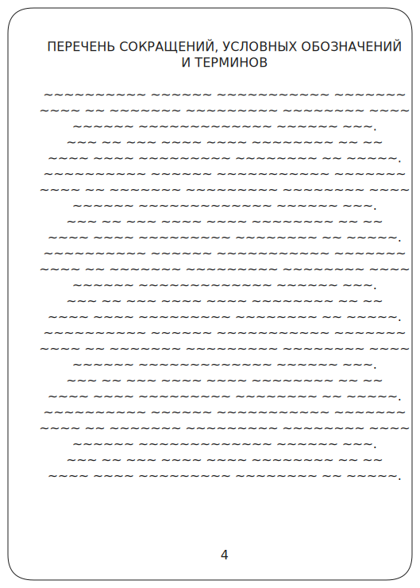
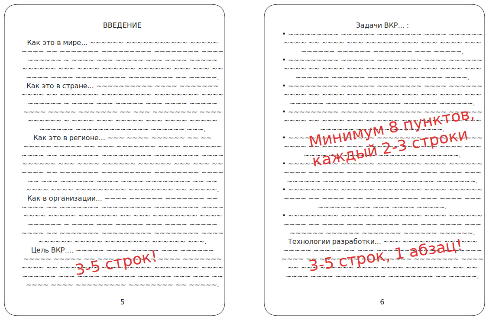
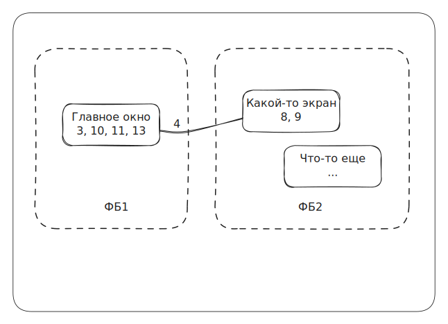

# Конспект по оформлению диплома

**Оглавление:**
- [Некоторые сокращения и требования](#некоторые-сокращения-и-требования)
- [Структура ПЗ:](#структура-пз)
  - [**ПЕРЕЧЕНЬ СОКРАЩЕНИЙ**](#перечень-сокращений)
  - [**ВВЕДЕНИЕ**](#введение)
  - [**1 ПОСТАНОВКА ЗАДАЧИ ВКР**](#1-постановка-задачи-вкр)
    - [1.1 Бизнес-требования](#11-бизнес-требования)
    - [1.2 Пользовательские требования](#12-пользовательские-требования)
    - [1.3 Системные требования](#13-системные-требования)
    - [1.4 Требования к пользовательскому интерфейсу](#14-требования-к-пользовательскому-интерфейсу)
    - [1.5 План-график выполнения ВКР](#15-план-график-выполнения-вкр)
  - [**2 АНАЛИЗ ТРЕБОВАНИЙ И ОПРЕДЕЛЕНИЕ СПЕЦИФИКАЦИЙ**](#2-анализ-требований-и-определение-спецификаций)
    - [2.1 Описание предметной области задачи ВКР](#21-описание-предметной-области-задачи-вкр)
      - [2.1.1 Информационные объекты предметной области и взаимосвязи между ними](#211-информационные-объекты-предметной-области-и-взаимосвязи-между-ними)
      - [2.1.2 Информационные потребности пользователей](#212-информационные-потребности-пользователей)
      - [2.1.3 Методы работы с информационными объектами предметной области](#213-методы-работы-с-информационными-объектами-предметной-области)
        - [2.1.3.1 Способы хранения информации об объектах предметной области](#2131-способы-хранения-информации-об-объектах-предметной-области)
        - [2.1.3.2 Математические модели, используемые для обработки информации](#2132-математические-модели-используемые-для-обработки-информации)
        - [2.1.3.3 Применяемые программные технологии обработки информации, основанные на математических моделях](#2133-применяемые-программные-технологии-обработки-информации-основанные-на-математических-моделях)
        - [2.1.3.4 Способы интерпретации и визуального представления информации](#2134-способы-интерпретации-и-визуального-представления-информации)
        - [2.1.3.5 Технологии получения и передачи информации](#2135-технологии-получения-и-передачи-информации)
      - [2.1.4 Обзор существующих программных реализаций решения задачи](#214-обзор-существующих-программных-реализаций-решения-задачи)
      - [2.1.5 Концептуальное обоснование разработки](#215-концептуальное-обоснование-разработки)
    - [2.2 Классы и характеристики пользователей](#22-классы-и-характеристики-пользователей)
    - [2.3 Функциональные требования](#23-функциональные-требования)
      - [2.3.1 Определение функциональных возможностей](#231-определение-функциональных-возможностей)
      - [2.3.2 Описание прецедентов](#232-описание-прецедентов)
    - [2.4 Нефункциональные требования](#24-нефункциональные-требования)
  - [**3 ВЫБОР ПРОГРАММНЫХ СРЕД И СРЕДСТВ РАЗРАБОТКИ**](#3-выбор-программных-сред-и-средств-разработки)
    - [3.1 Сравнительный анализ имеющихся возможностей по выбору средств разработки](#31-сравнительный-анализ-имеющихся-возможностей-по-выбору-средств-разработки)
    - [3.2 Характеристика выбранных программных сред и средств](#32-характеристика-выбранных-программных-сред-и-средств)
  - [**4 АЛГОРИТМЫ РЕШЕНИЯ ПОСТАВЛЕННОЙ ЗАДАЧИ**](#4-алгоритмы-решения-поставленной-задачи)
    - [4.1 Этапы реализации](#41-этапы-реализации)
    - [4.2 Пользовательский интерфейс](#42-пользовательский-интерфейс)
      - [4.2.1 Описание взаимодействия с пользователем](#421-описание-взаимодействия-с-пользователем)
      - [4.2.2 Определение операций пользователей и составление функциональных блоков](#422-определение-операций-пользователей-и-составление-функциональных-блоков)
      - [4.2.3 Проектирование структуры экранов и схемы навигации](#423-проектирование-структуры-экранов-и-схемы-навигации)
      - [4.2.4 Разработка дизайна интерфейса](#424-разработка-дизайна-интерфейса)
    - [4.3 Входные, выходные и промежуточные данные](#43-входные-выходные-и-промежуточные-данные)
    - [4.4 Реализация используемых методов хранения, обработки и передачи информации об объектах предметной области](#44-реализация-используемых-методов-хранения-обработки-и-передачи-информации-об-объектах-предметной-области)
      - [4.4.1 Методы хранения данных](#441-методы-хранения-данных)
      - [4.4.2 Алгоритмы реализации используемых математических моделей](#442---445)
      - [4.4.3 Алгоритмы использования применяемых программных технологий обработки данных](#442---445)
      - [4.4.4 Алгоритмы применения методов графического анализа данных](#442---445)
      - [4.4.5 Алгоритмы использования технологий передачи данных](#442---445)
    - [4.5 Описание архитектурного решения](#45-описание-архитектурного-решения)
      - [4.5.1 Структурная организация программной системы](#451-структурная-организация-программной-системы)
      - [4.5.2 Архитектура программного кода](#452-архитектура-программного-кода)
  - [**5 ТЕСТИРОВАНИЕ И ОПТИМИЗАЦИЯ**](#5-тестирование-и-оптимизация)
    - [5.1 План тестирования](#51-план-тестирования)
    - [5.2 Результаты тестирования и оптимизация](#52-результаты-тестирования-и-оптимизация)
  - [**6 РУКОВОДСТВО ПОЛЬЗОВАТЕЛЯ**](#6-руководство-пользователя)
  - [**ЗАКЛЮЧЕНИЕ**](#заключение)
  - [**СПИСОК ИСПОЛЬЗУЕМЫХ ИСТОЧНИКОВ**](#список-используемых-источников)
  - [**ПРИЛОЖЕНИЯ**](#приложения)
    - [Приложение А](#приложение-а)
    - [Приложение Б](#приложение-б)
    - [Приложение В](#приложение-в)
    - [Приложение Г](#приложение-г)
    - [Приложение Д](#приложение-д)
    - [Приложение Е](#приложение-е)

## Некоторые сокращения и требования

*Важные сокращения:*

- ПЗ - пояснительная записка.
- ПС - программное средство.
- ТЗ - техническое задание.

*Что обязательно должно быть в ПС на диплом?*

- Необходимо наличие авторизации и регистрации.
- Наличие личного кабинета.
- Разные категории пользователей.
- Наличие фильтров / тегов / поиска / т.п. (т.е. какая-то функциональность поиска и фильтрации).

*Оформление документа:*

- Название файла с ПЗ строго в формате **НОМЕРгруппы_ФамилияИО**! Иные файлы проверяться не будут!
- Шрифт *Times New Roman*, 12 пт, интервал 1,5.
- Титульный лист: тема, место работы, должность руководителя и ФИО должны соответствовать приказу.
- Содержание должно быть собрано автоматически, не забываем обновить полностью.
- Не допускается изменение формулировок *заголовков первого уровня*!
- Раздел не может начинаться с таблицы, рисунка или списка!
- Как правило, везде используется выравнивание по ширине, если не указано иного.
- Списки и правила их оформления:
  - Допустимы только нумерованный, маркированный и смешанные типы!
  - Один тип маркера на весь документ! Маркер в маркере нельзя!

## Структура ПЗ

### **ПЕРЕЧЕНЬ СОКРАЩЕНИЙ**

*Правила оформления раздела:*

- Запрещено использовать список или таблицу!
- Каждый термин с новой строки по образцу: \
  `Открытое акционерное общество (ОАО) — \[ определение, 2-3 строки ] \[ ТОЧКА ].`
- Объем не менее 2/3 страницы.
- Если термин упомянут менее 3-х раз, в этот раздел его не выносят, 
  расшифровывается непосредственно в тексте при первом упоминании.
- Однако, если в работе не используются сокращения и аббревиатуры, следует привести список спец. терминов, 
  характеризующих предметную область задачи и технологии для ее решения.
- Нельзя писать в этот раздел следующие сокращения: \
  *ТЗ, ПС, ПЗ, ВКР, БД, ОЗУ, ПО, ПК*!
- Зарисовка схемы оформления: \
  

---

### **ВВЕДЕНИЕ**

Введение - это актуальность, практическая ценность и значимость решения.

*Правила оформления раздела:*

- Объем 1,5-2 страницы, но не более 2 страниц.
- Нельзя использовать конструкции а-ля «в мире», в схеме дано лишь для примера!

*Схема оформления раздела:*

- Общий план:
  - Как это в мире.
  - Как в России.
  - Как в регионе.
  - Как в организации.
  - Цель ВКР (3-5 строк).
  - Задачи ВКР (список, не менее 8-ми пунктов, каждый по 2-3 строки).
  - Технологии для разработки (в один абзац, 3-5 строк).
- Зарисовка схемы оформления: \
  

---

### **1 ПОСТАНОВКА ЗАДАЧИ ВКР**

Между пунктами 1 и 1.1 может быть вводный кусок, но допустимо и его отсутствие.

#### 1.1 Бизнес-требования

*Правила оформления раздела:*

- Объем примерно 2/3 страницы.
- В целом можно использовать нейронки.

*Схема оформления раздела:*

- Вводный абзац (3-5 строк, обязательно).
- Требования (список, 3-5 пунктов, каждый по 2-3 строки). \
  С позиции того, какие процессы улучшит. \
  Что будет, если внедрить? \
  Какую выгоду принесет? (выгода бывает не только в деньгах) \
  Рассматриваем ПС как неделимое целое.

#### 1.2 Пользовательские требования

*Требования к оформлению раздела:*

- Объем примерно 2/3 страницы.
- Категорически не рекомендуется использовать нейронки!
- Опираемся на ТЗ (допускается практически дословное повторение).
- Разбивать описание по типам пользователей **НЕ НАДО**!
- **НЕ ДОЛЖНО** совпадать с [2.3.1](#231-определение-функциональных-возможностей)!

*Схема оформления раздела:*

- Вводный абзац (3-5 строк).
- Ссылка на ТЗ ([Приложение А](#приложение-а)). \
  Формулировка в духе
  > Разрабатываемое программное средство должно соответствовать требованиям, 
    утвержденным в техническом задании, представленном в Приложении А.
- Требования.

#### 1.3 Системные требования

*Требования к оформлению раздела:*

- Объем примерно 2/3 страницы.
- Составные части ПО рассматриваем с позиции архитектуры (клиент-сервер) и с позиции ФМ.
- ФМ **должны соответствовать** [4.2.2](#422-определение-операций-пользователей-и-составление-функциональных-блоков) 
                              и [4.2.3](#423-проектирование-структуры-экранов-и-схемы-навигации)!
- ФМ хорошо выделяют нейронки.
- У кого комплексные проекты, указывается комплексность тут.

*Схема оформления раздела:*

- Вводный абзац (3-5 строк).
- Требования с позиции архитектуры (список).
- Требования с позиции функциональных модулей (список) \
  Примеры ФМ:
  > ФМ ─> Работа с клиентами \
  > └──> Работа с товаром

#### 1.4 Требования к пользовательскому интерфейсу

*Требования к оформлению раздела:*

- Объем примерно 2/3 страницы.
- Допускается изменение названий подзаголовков.
- Можно прикрепить простые эскизы экранов.
- У кого серверная часть, описывать с позиции типов данных.

*Схема оформления раздела:*

- Вводный абзац (3-5 строк).
- Ссылка на ТЗ ([Приложение А](#приложение-а)).
- Требования.

*Частая ошибка нейронок:*

Нет конкретики! \
**НЕ ДОЛЖНО** быть фраз в духе «интуитивно понятный интерфейс», «в светлых тонах» и т.п.

#### 1.5 План-график выполнения ВКР

*Требования к оформлению раздела:*

- Объем примерно 2/3 страницы.
- Допускается изменение названий подзаголовков.
- Можно прикрепить простые эскизы экранов.
- У кого серверная часть, описывать с позиции типов данных.

*Схема оформления раздела:*

- Вводный абзац (3-5 строк).
- План. Допускается диаграмма Ганта, но проще использовать таблицу (по неделям).
- Вывод (3-5 строк).

---

### **2 АНАЛИЗ ТРЕБОВАНИЙ И ОПРЕДЕЛЕНИЕ СПЕЦИФИКАЦИЙ**

#### 2.1 Описание предметной области задачи ВКР

Между пунктами 2.1 и 2.1.1 **текст не допускается**!

##### 2.1.1 Информационные объекты предметной области и взаимосвязи между ними

*Требования к оформлению раздела:*

- Объем 1,5-2 страницы.
- Описывать **НЕ** с позиции пользователя!

*Схема оформления раздела:*

- Вводная часть (8 строк, рассказать про предприятие).
- Описание автоматизируемого процесса (преимущественно сплошным текстом).
- Схема.
- Информационные объекты (2-3 строки).

##### 2.1.2 Информационные потребности пользователей

*Требования к оформлению раздела:*

- Объем примерно 2/3 страницы.
- В этом подразделе формируем потребности участников автоматизируемого процесса (одушевленных).
- Описываем с позиции предметной области, но не с позиции айтишника, а чтобы «понять мог любой».

*Схема оформления раздела:*

- Вводная часть (3-5 строк).
- Участники и их потребности (текст)

##### 2.1.3 Методы работы с информационными объектами предметной области

*Требования к оформлению раздела:*

- Объем каждого подпункта не менее 2/3 страницы.
- В каждом подпункте вводный абзац 3-5 строк.
- В зависимости от тематики работы, **можно удалить** некоторые подразделы, 
  однако необходимо оставить как минимум три подраздела.

###### 2.1.3.1 Способы хранения информации об объектах предметной области

Информацию можно подать в двух вариантах:

1. Описываем «документы», в которых хранятся данные (с позиции предметной области). \
   Желательно добавить скрин как выглядят документы.
2. Описать технологию хранения (что такое реляционные базы данных). \
   Допускаются рисунки и схемы.

###### 2.1.3.2 Математические модели, используемые для обработки информации

Мат. модель = алгоритм решения.

- Если есть мат. модель, то расписываем подробно, используя формулы.
- Если есть расчет, но нет мат. модели, меняем название на «Алгоритм расчета».
- Если расчетов нет, то убираем подраздел.

###### 2.1.3.3 Применяемые программные технологии обработки информации, основанные на математических моделях

Технологии нейронных сетей.

- Если в проекте есть нейронки - описываем архитектуру нейронных сетей. Допускаются рисунки.
- Если нет, удаляем подраздел.

###### 2.1.3.4 Способы интерпретации и визуального представления информации

*Существуют следующие способы представления:*

1. Таблица,
2. Рисунок,
3. Схема,
4. График,
5. Диаграмма,
6. 3D-модель,
7. Чертеж,
8. Карта.

В целом необходимо привести сведения о том, какие графические методы применяются обычно для представления и анализа информации. Если в [2.1.3.1](#2131-способы-хранения-информации-об-объектах-предметной-области) документ, описать как работает.

###### 2.1.3.5 Технологии получения и передачи информации

Описать API (клиент-сервер), SQL-запросы. Допускаются схемы и рисунки.

##### 2.1.4 Обзор существующих программных реализаций решения задачи

*Требования к оформлению раздела:*

- Объем примерно 2/3 страницы.
- Аналоги: прямые (+/-) и частичные (что позаимствовали).

*Схема оформления раздела:*

- Вводная часть (3-5 строк).
- Аналоги по такой схеме:
  > Название (если веб - ссылка). \
  > Описание (3-5 строк). \
  > Скрин главного окна. \
  > Плюсы и минусы
- Вывод (3 строки)

*Есть второй вариант оформления:*

- Введение.
- Перечисление аналогов.
- Сравнение в виде таблицы с примерами.
- Вывод (8 строк).

В случае выбора второго варианта раздел [2.1.5](#215-концептуальное-обоснование-разработки) не делать!

##### 2.1.5 Концептуальное обоснование разработки

Обобщающий раздел.

*Требования к оформлению раздела:*

- Вывод к [2.1.1](#211-информационные-объекты-предметной-области-и-взаимосвязи-между-ними) - 
          [2.1.4](#214-обзор-существующих-программных-реализаций-решения-задачи).
- Объем примерно 2/3 страницы.

#### 2.2 Классы и характеристики пользователей

*Требования к оформлению раздела:*

- Выделение пользовательских ролей (групп пользователей).
- В таблице перечислить и охарактеризовать пользовательские роли.

*Схема оформления раздела:*

- Введение (3-5 строк).
- Таблица.
- Вывод (можно не делать).

#### 2.3 Функциональные требования

##### 2.3.1 Определение функциональных возможностей

*Требования к оформлению раздела:*

- **НЕ ДОЛЖНО** совпадать с [1.2](#12-пользовательские-требования)!

*Схема оформления раздела:*

- Введение (3-5 строк).
- Содержание по такой схеме:
  > Функциональные возможности Пользователя (по ролям). \
  > Диаграмма *use case*.
- Вывод (можно не делать).

##### 2.3.2 Описание прецедентов

*Схема оформления раздела:*

- Введение (2-3 строки).
- Описание прецедентов в таблице.

#### 2.4 Нефункциональные требования

Требования к железу, ПО и т.п.

---

### **3 ВЫБОР ПРОГРАММНЫХ СРЕД И СРЕДСТВ РАЗРАБОТКИ**

Если в ТЗ жестко указано средство разработки, то раздела 
[3.1](#31-сравнительный-анализ-имеющихся-возможностей-по-выбору-средств-разработки) и 
[3.2](#32-характеристика-выбранных-программных-сред-и-средств) не будет!

*Схема оформления раздела:*

- Вводная часть (3-8 строк).
- Язык программирования и его характеристики. 1/3 страницы для каждого.
- Графический редактор, если есть клиентская часть.

#### 3.1 Сравнительный анализ имеющихся возможностей по выбору средств разработки

*Требования к оформлению раздела:*

- Что может быть включено в список:
  > Язык программирования \
  > Среда разработки \
  > Фреймворки \
  > СУБД \
  > Графический редактор
- Объем не меньше страницы.
- Если пунктов очень много, выделяем разделы вида:
  > 3.1.1 Язык... \
  > 3.1.2 Среда...

*Схема оформления раздела:*

- Вводная часть
- Средство разработки (2 и более) по схеме:
  > Название. \
  > Что это такое (1-3 строки). \
  > Сравнение - таблица или достоинства и недостатки. \
  > Вывод
- Общий вывод «На основе сравнения выбран...»

#### 3.2 Характеристика выбранных программных сред и средств

*Схема оформления раздела:*

- Вводная часть
- Язык программирования. Характеристика (те, что выбрали). Примерно 1/3 страницы каждый пункт.

---

### **4 АЛГОРИТМЫ РЕШЕНИЯ ПОСТАВЛЕННОЙ ЗАДАЧИ**

#### 4.1 Этапы реализации

*Требования к оформлению раздела:*

- Объем примерно 2/3 страницы.

*Схема оформления раздела:*

- Вводная часть.
- Пункты (сплошным текстом).

#### 4.2 Пользовательский интерфейс

Диаграмма взаимодействия, можно общую для серверной части.

##### 4.2.1 Описание взаимодействия с пользователем

*Требования к оформлению раздела:*

- Общая (пользователь - система). По одной схеме для каждого типа пользователя.
- Конкретная (например, зарегистрированный пользователь хочет изменить фото).
- В данном разделе требуются только одна общая и одна конкретная схемы.
- То, что не было включено, помещается в Приложение <!-- ???????????????????-->.
- Если помещается полностью - описывать не надо.

*Схема оформления раздела:*

- Вводная часть.
- Схемы по следующему плану:
  > Описание схемы \
  > Схема

##### 4.2.2 Определение операций пользователей и составление функциональных блоков

*Первый вариант оформления раздела:*

- Вводная часть.
- Операции (20-80).

*Второй вариант оформления раздела:*

Операции разделены на функциональные блоки. 
Что-то очень похожее на [1.3](#13-системные-требования).

- Вводный абзац.
- Функциональные блоки по схеме:
  > Функциональный блок (можно пояснить за что отвечает). \
  > 1\. Операция 1 \
  > 2\. ... \
  > Функциональный блок...

*Третий вариант оформления раздела:*

- Вводный абзац.
- Таблица по схеме:
  > | №   | Операция          | ФБ  |
  > |-----|-------------------|-----|
  > | 1   | Название операции | ФБ1 |
  > | 2   | Название операции | ФБ2 |
  > | ... | ...               | ... |

##### 4.2.3 Проектирование структуры экранов и схемы навигации

*Требования к оформлению раздела:*

- Объем примерно 2/3 страницы.

*Схема оформления раздела:*

- Вводная часть.
- Экраны (можно пояснить, что это за экран).
- Описание схемы (пояснение условных обозначений, т.е. что за квадратики, циферки, полосочки, пунктир).

*Зарисовка примерного вида схемы экранов:*

##### 4.2.4 Разработка дизайна интерфейса

*Требования к оформлению раздела:*

- Схема -> Макет -> Макет в цвете.
- Описание каждого этапа, каждого окна.
- Если лень, можно выбрать один этап и очень подробно описать.
- **НЕЛЬЗЯ** вставлять готовые скрины!

#### 4.3 Входные, выходные и промежуточные данные

*Требования к оформлению раздела:*

- Объем примерно 2/3 страницы.
- Допускается разделение на подразделы.
- Входные данные - все, что поступает от пользователя.
- Выходные данные - все, что видит пользователь (напр. отчеты, pdf).
- Промежуточные данные - расчеты.

*Схема оформления раздела:*

- Вводная часть.
- Рассмотрим входные данные...
  > Например, для Регистрации это логин и пароль. \
  > Обязательно показать (на скриншоте вводятся данные).

#### 4.4 Реализация используемых методов хранения, обработки и передачи информации об объектах предметной области

Тут схемы (?).

##### 4.4.1 Методы хранения данных

*Требования к оформлению раздела:*

- Объем 1,5-2 страницы.

*Схема оформления раздела:*

- Вводная часть.
- Таблицы (сущности).
- ER-диаграмма.
- Словесное описание связей.

##### Разделы 4.4.2 - 4.4.5

Для этих разделов предлагается общая схема размещения данных.

*Требования к оформлению разделов:*

- Объем примерно 2/3 страницы.

*Схема оформления разделов:*

- Вводный абзац (3-5 строк).
- Словесное описание алгоритма (описание программного кода, методов, функций).
  > Вариант написания: \
  > Закинуть код в нейронку -> попросить прокомментировать -> попросить словесно описать.
- Скриншот кода.
- Фрагмент кода.
- Блок-схема UML (диаграмма состояния или активности).

*Некоторые подробности:*

- 4.4.2 Алгоритмы реализации используемых математических моделей: \
  Пишем как запрограммирована мат. модель.
- 4.4.3 Алгоритмы использования применяемых программных технологий обработки данных: \
  Если применялась нейронная сеть - пишем. \
  Можно разделить на подразделы Реализация модели, Подготовка датасета, Обучение.
- 4.4.4 Алгоритмы применения методов графического анализа данных: \
  Описывается реализация, программирование, применение графических объектов 
                                       (карты, чертежи, 3D-модели, графики)
- 4.4.5 Алгоритмы использования технологий передачи данных: \
  Как клиент взаимодействует с сервером, взаимодействие с API, SQL-запросы.

#### 4.5 Описание архитектурного решения

##### 4.5.1 Структурная организация программной системы

*Требования к оформлению раздела:*

- Объем примерно 2/3 страницы.
- Указывается из чего состоит программное средство. \
  Диаграмма компонентов + взаимодействия + развертывания.
- Диаграмма прикладывается **в векторе**!

*Схема оформления раздела:*

- Вводная часть (3-5 строк).
- Диаграмма.
- Описание диаграммы.

##### 4.5.2 Архитектура программного кода

Диаграмма классов. Сделать по таблице стилей (?).

---

### **5 ТЕСТИРОВАНИЕ И ОПТИМИЗАЦИЯ**

#### 5.1 План тестирования

Перечисление выбранных тестов с обоснованием почему.

#### 5.2 Результаты тестирования и оптимизация

Как я понял, для каждого теста отдельный пункт, по следующей схеме:

- Введение (3-5 строк).
- Алгоритм тестирования (по шагам).
- Тестовые данные.
- Результаты (таблица).
- Скрины, протоколы (в Приложении).  <!-- ничего не понятно, но очень интересно! -->

---

### **6 РУКОВОДСТВО ПОЛЬЗОВАТЕЛЯ**

*Схема оформления раздела:*

- Вводная часть (3-5 строк).
- Текст по схеме:
  > Текст (от третьего лица) \
  > [ СКРИНШОТ ] \
  > ...

---

### **ЗАКЛЮЧЕНИЕ**

*Требования к оформлению раздела:*

- Объем 2 страницы.
- Выводы по разделу (??).
- Конкретизировать в соответствии со своей темой.

---

### **СПИСОК ИСПОЛЬЗУЕМЫХ ИСТОЧНИКОВ**

*Требования к оформлению раздела:*

- При ссылке из текста использовать `Текст [1]`.
- Сортировка по мере встречаемости.
- Использование списка вида:
  > 1   Текст текст текст
- Источниками могут быть книги, статьи в журналах, интернет-ресурсы.
- Настоятельно рекомендуются для формирования списка онлайн-порталы.
- Количество источников не менее 3-х, не более 10-ти!
- Разделы, в которых должны быть ссылки: \
  Введение, 2.1.1, 2.1.3, 2.3.1, 3.2.

---

### **ПРИЛОЖЕНИЯ**

Информация не должна дублировать текст ПЗ!

#### Приложение А

ТЗ от заказчика (скан с печатью и подписью).

#### Приложение Б

Диаграмма вариантов (если большая).

#### Приложение В

Графики, рисунки и т.п. из раздела 4.

#### Приложение Г

Результаты тестирования (протоколы).

#### Приложение Д

Листинг кода.

*Требования к оформлению раздела:*

- Шрифт 10 пт, одинарный интервал, два столбца.
- Текст, не скрины!
- До 10 страниц.

#### Приложение Е

Акт внедрения, если есть.
