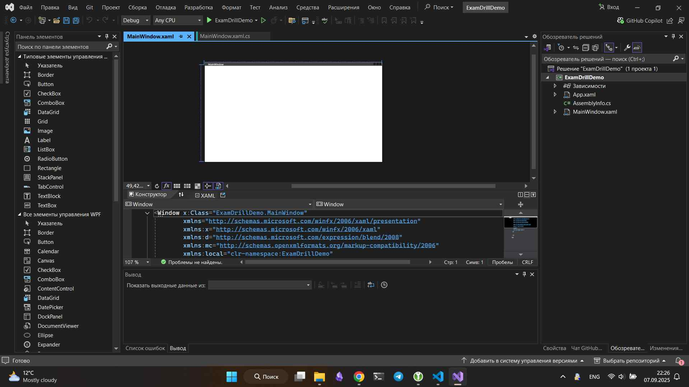

# 🔥 Спидран экзамена (и не только)

> Motto: Ship it, don't perfect it 🚀

В этом разделе собраны минимально необходимые знания и некоторые шаблоны для быстрого создания WPF-приложения с базой данных за ограниченное время. Фокус на скорость выполнения, а не на архитектурную красоту, по последней сделано много допущений и упрощений.

## ⚡ Первые 30 минут - Это База

### 🗂️ Создаем WPF проект + SQLite

В Visual Studio создаем новый проект `Приложение WPF (Майкрософт)`.



Устанавливаем `Microsoft.EntityFrameworkCore.Sqlite`, для этого открываем `Проект > Управление пакетами NuGet...`. Или, что проще, можно открыть терминал (`ПКМ на проект > Открыть в терминале`) и там выполнить:

```ps
dotnet add package Microsoft.EntityFrameworkCore.Sqlite
```

Для базового примера возьмем абстрактную идею, где пользователю надо будет хранить примерно такие данные:

**Items:**

| Id | Name  | Category | Notes      | Tags              |
|----|-------|----------|------------|-------------------|
| 1  | aboba | abobus   | haha, ohoh | lol, kek, 4eburek |

**Tags:**

| Id | Name    |
|----|---------|
| 1  | lol     |
| 2  | kek     |
| 3  | 4eburek |

**Notes:**

| Id | Text  | Item         |
|----|-------|--------------|
| 1  | haha  | aboba (Id 1) |
| 2  | ohoh  | aboba (Id 1) |

### 📝 Модели данных (классы)

Создаем примерно такую структуру в проекте:

```tree
ExamDrillDemo/
├── Models/
│   ├── Item.cs
│   ├── Category.cs
│   ├── Note.cs
│   ├── Tag.cs
│   └── ItemTag.cs
├── Data/
│   └── AppDbContext.cs
├── MainWindow.xaml
├── MainWindow.xaml.cs
```

В каждой модели примерно такое содержание:

**Item.cs**

| Id       | Name   | CategoryId |
|----------|--------|------------|
| int (PK) | string | int (FK)   |

```csharp
public class Item {
    public int Id { get; set; }
    public string Name { get; set; } = string.Empty;
    public int CategoryId { get; set; }
    public Category? Category { get; set; }
    public List<Note>? Notes { get; set; }
    public List<ItemTag>? ItemTags { get; set; }
}
```

**Category.cs**

| Id       | Title  |
|----------|--------|
| int (PK) | string |

```csharp
public class Category {
    public int Id { get; set; }
    public string Title { get; set; } = string.Empty;
    public List<Item>? Items { get; set; }
}
```

**Note.cs**

| Id       | Text   | ItemId   |
|----------|--------|----------|
| int (PK) | string | int (FK) |

```csharp
public class Note {
    public int Id { get; set; }
    public string Text { get; set; } = string.Empty;
    public int ItemId { get; set; }
    public Item? Item { get; set; }
}
```

**Tag.cs**

| Id       | Name   |
|----------|--------|
| int (PK) | string |

```csharp
public class Tag {
    public int Id { get; set; }
    public string Name { get; set; } = string.Empty;
    public List<ItemTag>? ItemTags { get; set; }
}
```

**ItemTag.cs**

| Id       | ItemId   | TagId    |
|----------|----------|----------|
| int (PK) | int (FK) | int (FK) |

```csharp
public class ItemTag {
    public int Id { get; set; }
    public int ItemId { get; set; }
    public Item? Item { get; set; }
    public int TagId { get; set; }
    public Tag? Tag { get; set; }
}
```

По большей части все относительно понятно, но чуть подробнее про некоторые моменты.

1. Использование `nullable` для навигационных свойств, чтобы не вызывать предупреждения. Это защищает от ситуации, когда связь отсутствует.
2. Для решения проблем с инициализацией строки юзаем `= string.Empty`. Это сахар, заменяющий инициализацию строки в конструкторе.
3. На этом этапе пока что только просто модели данных! Не заморачиваемся с авторизацией и ролями, это позже.

### 🗃️ База данных (Code First)

Теперь необходимо создать БД. Открываем `AppDbContext.cs` и приводим его к примерно следующему виду:

```csharp
internal class AppDbContext : DbContext {

    public DbSet<Item> Items { get; set; }
    public DbSet<Category> Categories { get; set; }
    public DbSet<Note> Notes { get; set; }
    public DbSet<ItemTag> ItemTags { get; set; }
    public DbSet<Tag> Tags { get; set; }

    public AppDbContext() {
        Database.EnsureCreated();
    }

    protected override void OnConfiguring(DbContextOptionsBuilder optionsBuilder) {
        optionsBuilder.UseSqlite("Data Source=app.db");
    }

    protected override void OnModelCreating(ModelBuilder modelBuilder) {

        modelBuilder.Entity<Item>()
            .HasOne(i => i.Category)
            .WithMany(c => c.Items)
            .HasForeignKey(i => i.CategoryId);

        modelBuilder.Entity<Note>()
            .HasOne(n => n.Item)
            .WithMany(i => i.Notes)
            .HasForeignKey(n => n.ItemId);

        modelBuilder.Entity<ItemTag>()
            .HasKey(it => it.Id);

        modelBuilder.Entity<ItemTag>()
            .HasOne(it => it.Item)
            .WithMany(i => i.ItemTags)
            .HasForeignKey(it => it.ItemId);

        modelBuilder.Entity<ItemTag>()
            .HasOne(it => it.Tag)
            .WithMany(t => t.ItemTags)
            .HasForeignKey(it => it.TagId);

        modelBuilder.Entity<Category>().HasData(
            new Category { Id = 1, Title = "abobus" }
        );

        modelBuilder.Entity<Tag>().HasData(
            new Tag { Id = 1, Name = "lol" },
            new Tag { Id = 2, Name = "kek" },
            new Tag { Id = 3, Name = "4eburek" }
        );

        modelBuilder.Entity<Item>().HasData(
            new Item { Id = 1, Name = "aboba", CategoryId = 1 }
        );

        modelBuilder.Entity<Note>().HasData(
            new Note { Id = 1, Text = "haha", ItemId = 1 },
            new Note { Id = 2, Text = "ohoh", ItemId = 1 }
        );

        modelBuilder.Entity<ItemTag>().HasData(
            new ItemTag { Id = 1, ItemId = 1, TagId = 1 },
            new ItemTag { Id = 2, ItemId = 1, TagId = 2 },
            new ItemTag { Id = 3, ItemId = 1, TagId = 3 }
        );
    }
}
```

Немного пояснений о содержимом:

- `public DbSet<СУЩНОСТЬ> СУЩНОСТИ { get; set; }` - создает таблицу в БД для каждой сущности. DbSet позволяет делать запросы и изменения.
- `optionsBuilder.UseSqlite("Data Source=app.db");` - настраивает подключение к SQLite базе данных в файле _app.db_.
- `modelBuilder.Entity<СУЩНОСТЬ>().HasOne(...).WithMany(...).HasForeignKey(...)` - настраивает связи между таблицами _(один-ко-многим)_.
- `modelBuilder.Entity<СУЩНОСТЬ>().HasData(...)` - заполняет таблицы начальными данными при создании БД.
